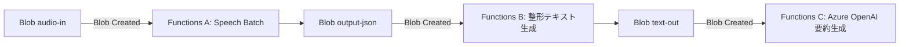

# Azure Meeting Transcriber

## 概要
録音済み会議音声をAzure Blob Storageにアップロードすると、自動で文字起こしを実施し、整形済みテキストと会議要約を生成するシステム。

## 目的
- 会議後の音声データから素早く議事録を生成  
- 手動での文字起こし作業を削減し、会議内容の検索・共有を効率化

## 処理フロー
1. 会議音声(mp3等)を `audio-in` コンテナにアップロード  
2. アップロードを検知 → Functions AがSpeech Batchを起動  
3. Speechが `output-json` コンテナに文字起こし結果を保存  
4. Functions BがJSONを整形 → `text-out` コンテナに保存  
5. 整形テキストを検知 → Functions C がAzure OpenAIを呼び出し要約を生成  
6. 最終的な要約結果を `summary-out` などのコンテナに保存  

## アーキテクチャ

## 使用サービス
- **Azure AI Speech (Batch Transcription)**: 音声ファイルを文字起こしする  
- **Azure Blob Storage**: 音声ファイル、文字起こし結果、要約結果を格納  
- **Azure Functions**: Blobの変更イベントをトリガーに処理を自動実行  
- **Azure OpenAI**: 文字起こし結果を要約、議事録化  
